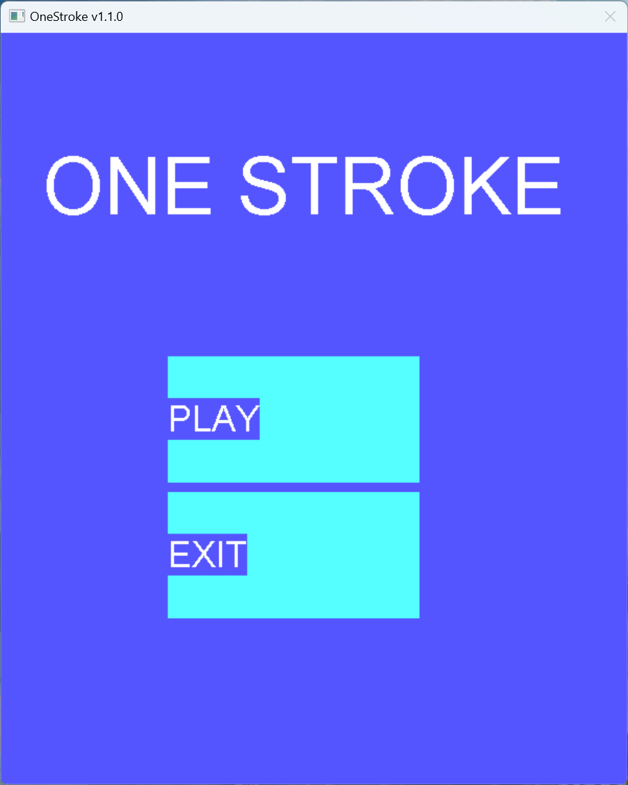
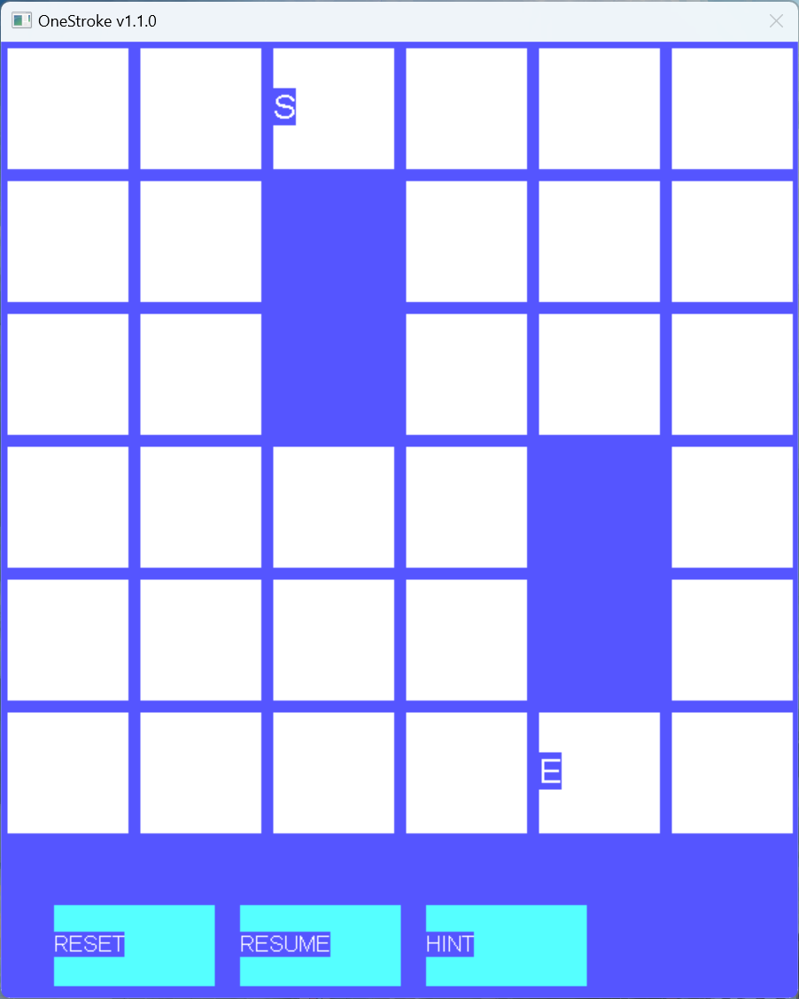

# OneStroke
## Pure C++20 EasyX MiniGame

  
  

### How To Play
Click "Play" to start a random level.  
You need to draw a continuous path from the start (s) point to the end (e) point.  
Click the white block to add it to your path.  
Your path must cover every visible white block in the map.  
### How To Reset
If you have made a mistake, click the "Reset" button to restart this level.  
### How To Get Hint
If you cannot solve the level by yourself, you can click the "Hint" button.  
### How To Exit
Click "Resume" to back to main menu.  
Click "Exit" to exit game.  